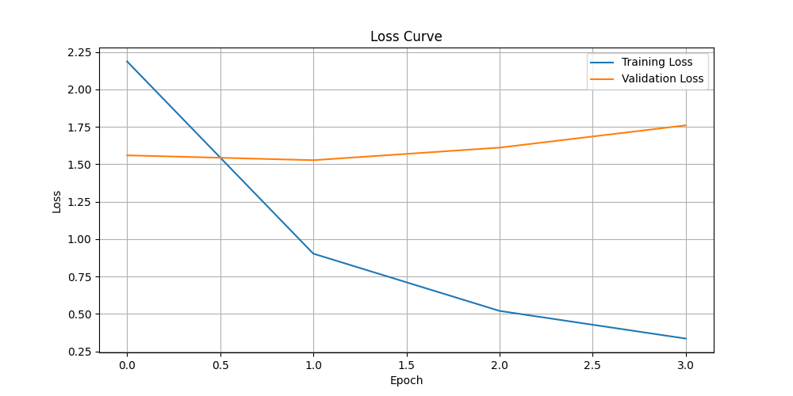

## HPC AI Lab 1&2: Baseline - revisited
#### Introduction
The task is fully defined [here](https://awesome-archduke-bec.notion.site/Lab-AI-HPC-Tools-e647da3f04dc4e66a40692da0d5f9c27). In short, the goal of the baseline task is to train a BERT-Base model on the SQuAD dataset using PyTorch on a single NVIDIA A100 GPU. We must do this by adapting existing code to fine-tune bert-base-uncased model on SQuAD dataset. The code runs on the venv created in class.

It must contain:
- A  README.md explaining scripts used, training time or profiling results and any clarifications or comments
- All python, bash and SLURM scripts

I delivered the project in the past, but it was a poor job, and I got the following comments:
- There is a baseline but seems not using GPU at all or there is no evidence of being run at all. Results are not reported.
- No distributed version yet
- Baseline seems functional, but no evidence of using the GPU

To be honest I didn't really understand what I was doing, and the quality of the job reflected that. I was lucky to have some friends from the AI degree in the same office as me at work suggest some examples online, and my work in this delivery is based on [this repo](https://github.com/alexaapo/BERT-based-pretrained-model-using-SQuAD-2.0-dataset).

### Code implementation
This code is divided in different steps, each exlained in the [jupyter notebook](https://github.com/Aleeja137/HPCTools-1-2-NN_Training/blob/master/BASELINE/baseline.ipynb):
- Preparing the data
- Importing necessary libraries
- Getting the dataset ready
    - Loading the data from the files
    - Checking the data
    - Fixing the data and preparing it as 'bert understandable' format (tokens)
    - Creating Dataset classes for easier management
    - Using DataLoader to divide the datasets in batches
- Building the model
- Training and validating the model
- Plotting train and validation losses

The equivalent [python script](https://github.com/Aleeja137/HPCTools-1-2-NN_Training/blob/master/BASELINE/baseline.py) was modified a bit:
- Repeating code chunks where written as functions to reduce the script length. Having repeated code helped me during development time and made every step more intuitive, but for launching the script I wanted to have a more compact code.
- I ran into some errors with char_to_token and transformers libary versions, the remain as comments if I continue working on this and they appear again. 
- The losses plot is not displayed, rather it is saved to file

During my tests on the interactive session, I ran into problems when tokenizing the whole dataset, the kernel would disconned at various percetages of completion, but never more than 28%. I used google collab too, and it ran out of memory. So, since the purpose of the task is not to train a competitive model, it is to become familiar with its implementation and execution, I reduced the dataset to 10k for trainign, and 2k for evaluating. In return, I used 4 epochs (with the T4 GPU it took around 18min per epoch for training, it is faster with the A100).

### Results
I used tqdm, same as in the notebook, and it prints a lot of lines, so I added a [modified output file](https://github.com/Aleeja137/HPCTools-1-2-NN_Training/blob/master/BASELINE/slurm-12885645-short.out) without all the uninteresting lines. The [original](https://github.com/Aleeja137/HPCTools-1-2-NN_Training/blob/master/BASELINE/slurm-12885645.out) can still be seen there.

The results for the sequential version are seen here:    
https://github.com/Aleeja137/HPCTools-1-2-NN_Training/blob/master/BASELINE/slurm-12885645-short.out#L118-L119    
  
Epoch 1 | Train Loss: 2.1868 | Val Loss: 1.5594  
Epoch 2 | Train Loss: 0.9028 | Val Loss: 1.5270  
Epoch 3 | Train Loss: 0.5205 | Val Loss: 1.6109  
Epoch 4 | Train Loss: 0.3357 | Val Loss: 1.7596  
Total Time: 1125.2345921993256  

### Visualization
We can see the convergence evolution during epochs in graph format:


looks like with the reduced dataset, just 1 epoch is best to reduce overfitting.

### How to run the code
To run the python script, it is enough to call  
`sbatch launch_baseline.sh`

Alternatively, to run the jupyter notebook, it is enough to call  
`sbatch launch_baseline_notebook.sh`

Or open an interactive session by calling  
```
compute --gpu
source $STORE/mypython/bin/activate
jupyter-nbconvert --to notebook --execute baseline.ipynb --inplace --ExecutePreprocessor.kernel_name=mypython --ExecutePreprocessor.timeout=-1  
```
Or opening an interactive jupyter notebook web version  
```
compute --gpu
source $STORE/mypython/bin/activate
python -m ipykernel install --user --name=mypython
jupyter lab --ip  `hostname -i`
```

#### Next steps
- **Profiling**: Adding profiling can bring a new insight in the training process, such as (fill this). This could be implemented with (add here). 
- **Testing over the whole dataset**: Using the whole dataset would certainly bring different results.
- **Reduce Epochs**: More epochs reduce the training loss but increases the validation loss. This is a clear sign for overfitting. Using the whole datasing would show a different loss curve. In this case, 1 epoch is enough. 
